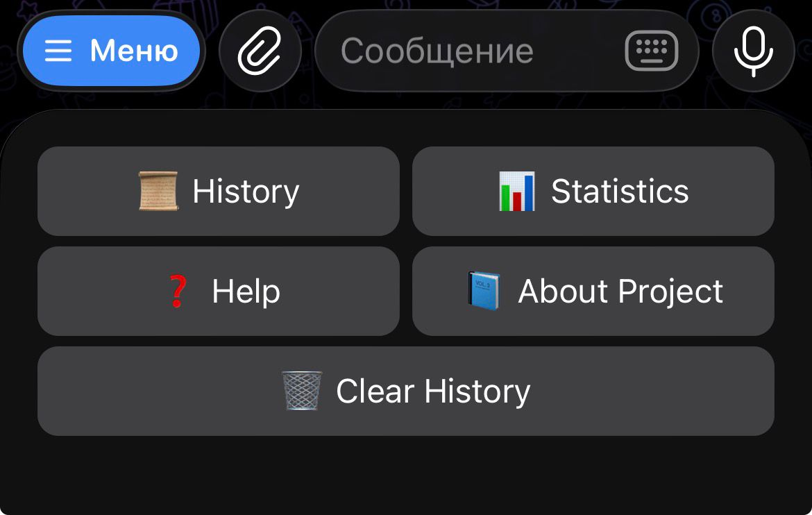
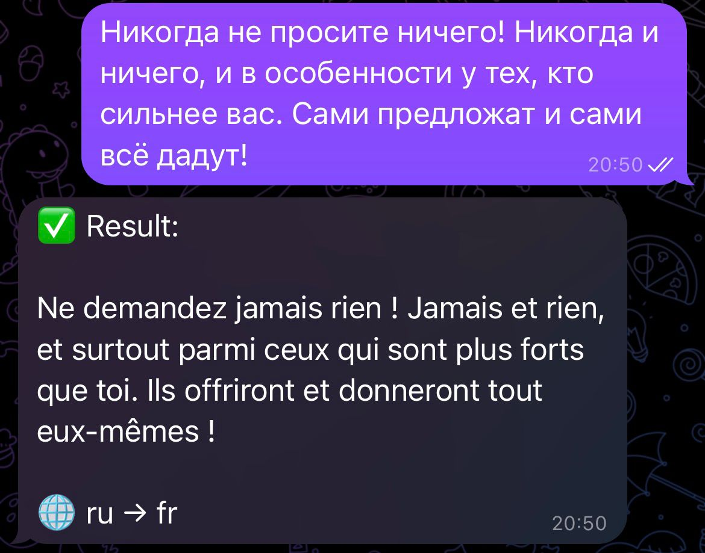
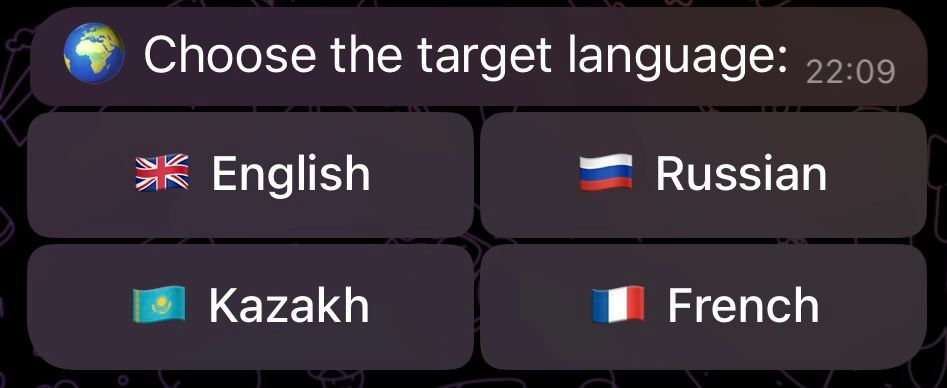
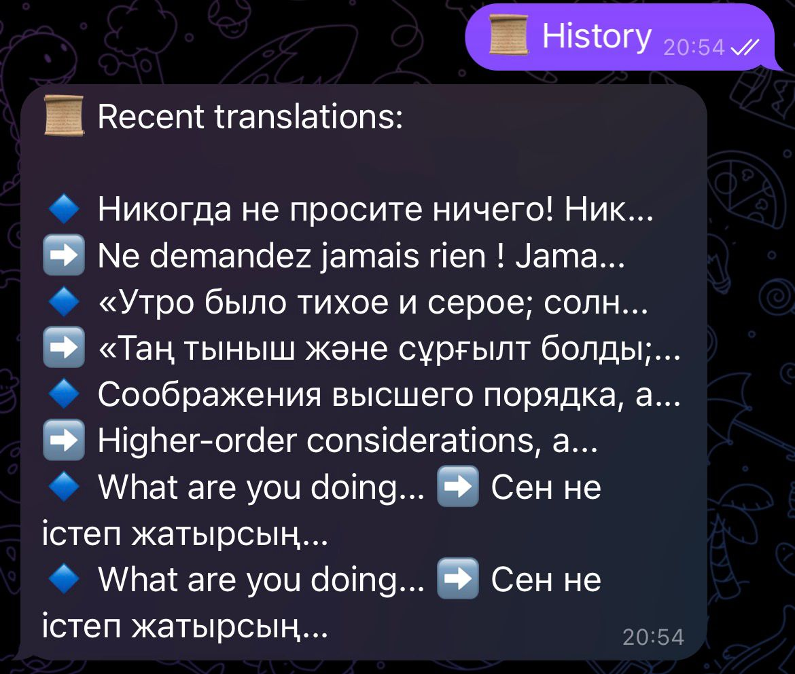
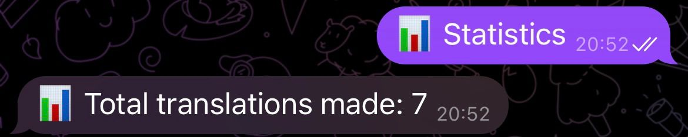
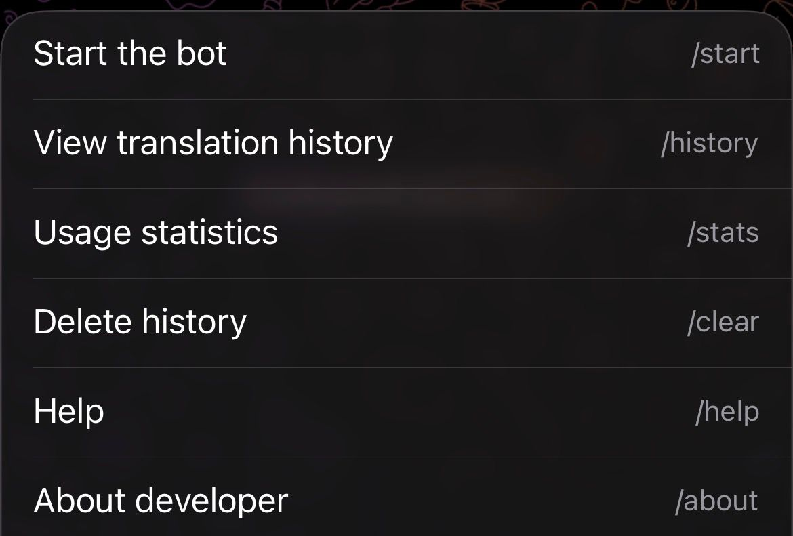

# 🤖 Telegram Translator Bot

## 1. Project Name
**Telegram Translator Bot**

---

## 2. Project Description
Telegram Translator Bot is an intelligent chatbot developed in Python for the Telegram platform.  
The bot automatically detects the language of the user's text and translates it into the selected language.

Supported languages:
- 🇬🇧 English
- 🇷🇺 Russian
- 🇰🇿 Kazakh
- 🇫🇷 French

The bot also:
- saves translation history,
- shows usage statistics,
- provides a user-friendly interface with buttons.

---

## 3. Technologies Used

| Technology          | Purpose |
|---------------------|---------|
| Python 3.14         | Main programming language |
| python-telegram-bot | Telegram bot framework |
| deep-translator     | Text translation |
| langdetect          | Automatic language detection |
| SQLite              | Database for history and statistics |
| python-dotenv       | Environment variable management |

---

## 4. Installation Instructions

Follow these steps to set up the project on your local machine:

### Step 1: Open the project folder
- 1.Download or unpack the project archive into a folder on your computer.
- 2.Open your terminal (Command Prompt, PowerShell, or Terminal on macOS/Linux).
- 3.Navigate to the project directory using the cd command:
   ```bash
   cd path/to/your/translator-bot
  ```
### Step 2:Set up a virtual environment(Recommended)
Create and activate a virtual environment to isolate project dependencies:
- On Windows:
```bash
python -m venv venv
venv\Scripts\activate
```
- On MacOS/Linux:
```bash
python3 -m venv venv
source venv/bin/activate
```
### Step 3: Install dependencies
```bash
pip install python-telegram-bot deep-translator langdetect python-dotenv
```
### Step 4: Create .env file
- Inside the project folder create a file named:
`.env` 
- Add your Telegram bot token: `TOKEN=your_telegram_bot_token_here`

---

### 5. Running the Bot

Start the bot using:
```bash
python bot.py
``` 
If everything is correct, you will see:
`Bot started...`

---

### 6. Example Bot Usage
- User: Hello
- Bot: 👋 Сәлем / Привет / Bonjour (depending on selected language)
- User: Привет
- Bot: Hello
- Buttons:
- 🌐 Change Language
- 📊 Statistics
- 🕘 History

---

### 7. Screenshots

### Main menu interface:


### Translation example:


### Language selection panel:


### History:


### Statistics:


## Help:


--- 

### Author: Yerzhan Berdigali
### Subject: Python Programming